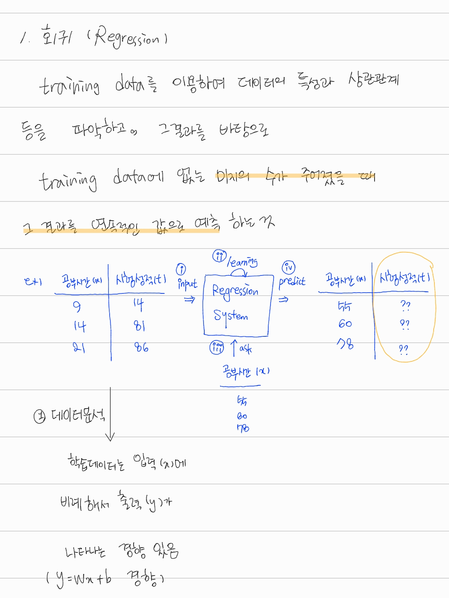
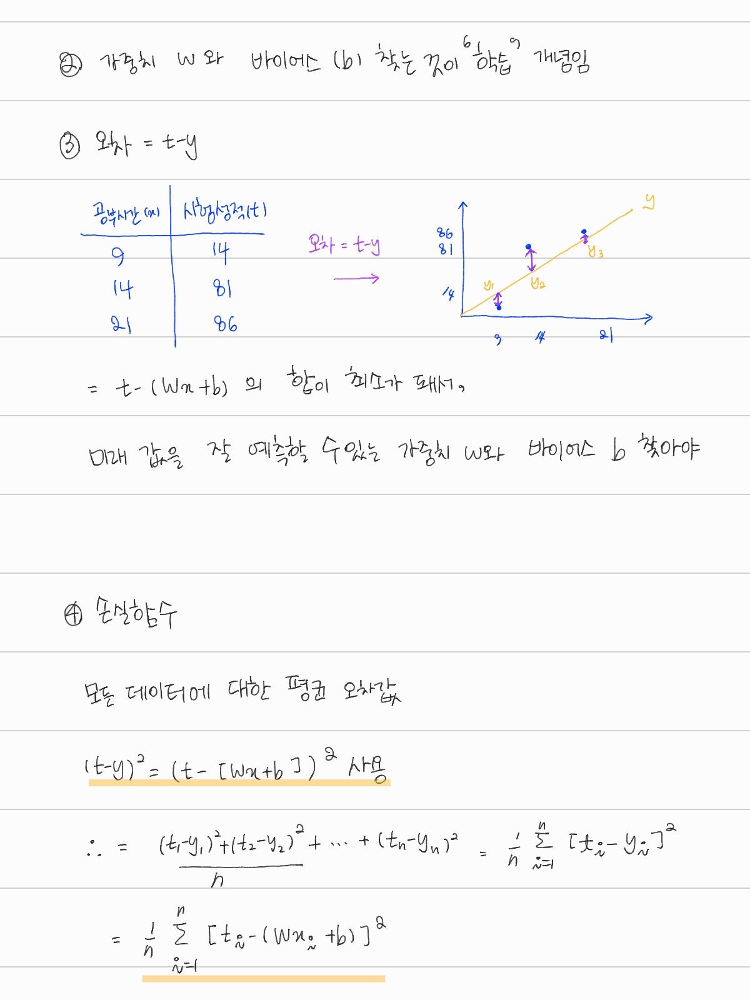
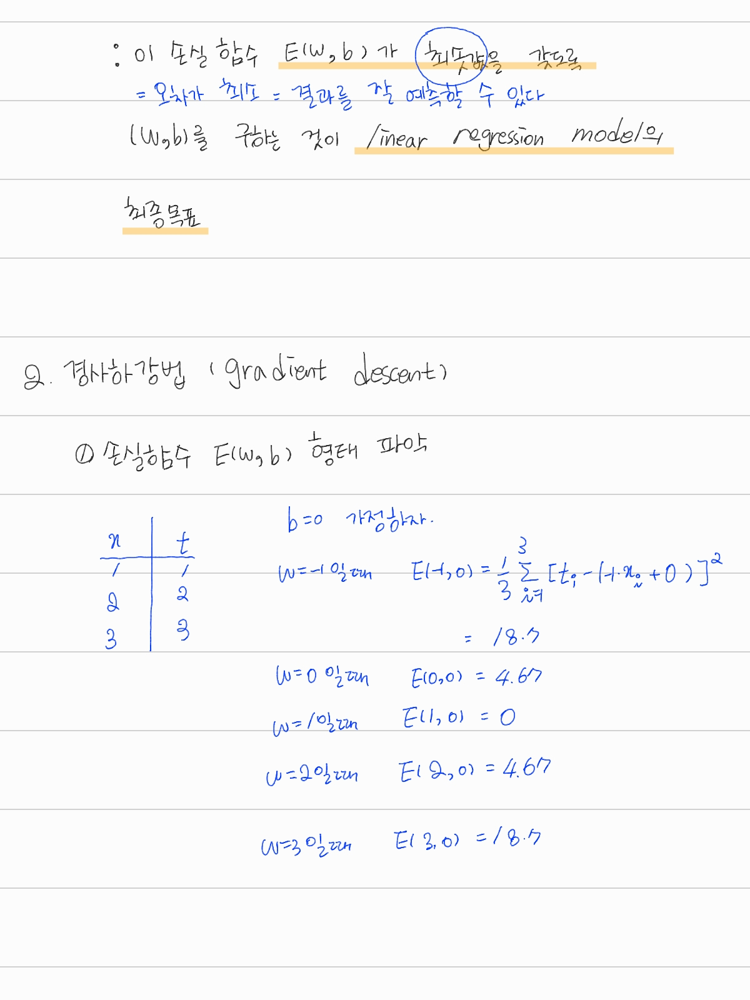
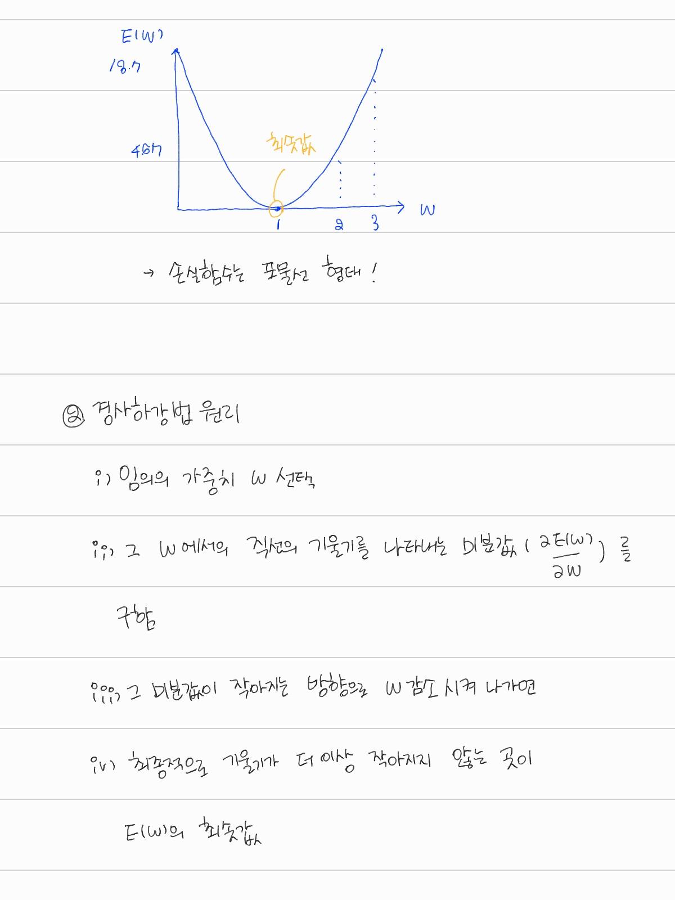
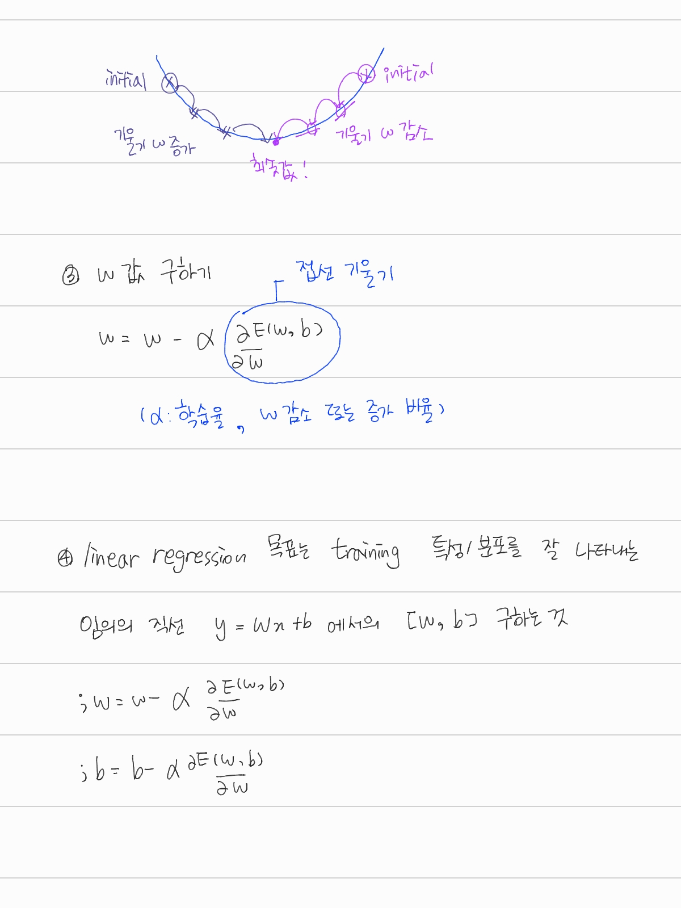
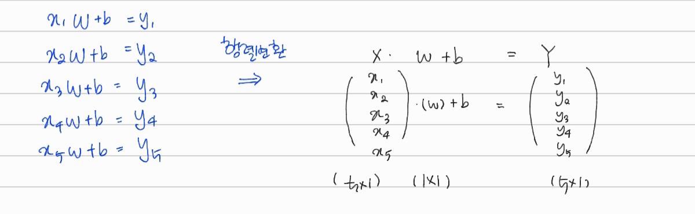
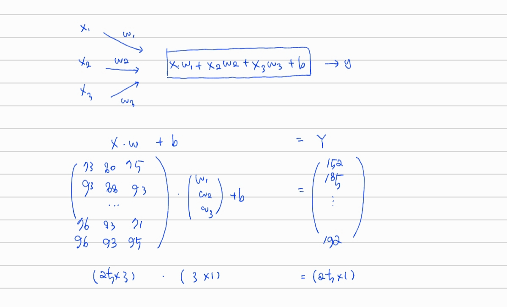

# 개념 정리







# 구현

## simple linear regression 구현

- 학습데이터

| 입력 (x) | 정답 (t) |
| -------- | -------- |
| 1        | 2        |
| 2        | 3        |
| 3        | 4        |
| 4        | 5        |
| 5        | 6        |

1. 입력(x) 및 정답(t)

   슬라이싱 또는 list comprehension으로 입력 x와 정답 t를 numpy 데이터 형으로 분리

   ## # 행렬변환

   

```python
import numpy as np

x_data = np.array([1,2,3,4,5]).reshape(5, 1) # 5 x 1 행렬로 변환
t_data = np.array([2,3,4,5,6]).reshape(5, 1) # 5 x 1 행렬로 변환
```

2. y= Wx + b

   W, b는 random으로 설정

```python
W = np.random.rand(1,1)
b = np.random.rand(1)
print("W = ", W, "b = ", b)
```

```
W =  [[0.31404614]] b =  [0.11203416]
```

3. regression 손실함수 E(W, b)

```python
def loss_func(x, t):
    y = np.dot(x, W) + b # X, w, t, y 모두 numpy 행렬

    return (np.sum((t-y)**2)) / len(x)
```

4. 학습률 알파

```
learning_rate = 1e-3
```

발산 시 1e-4, 1e-5 등으로 바꿔서 사용

### 수치미분 함수 (접선 기울기 구하기 위해)

```python
def numerical_derivative(f, x):
    delta_x = 1e-4 # 0.0001
    grad = np.zeros_like(x)

    it = np.nditer(x, flags=['multi_index'], op_flags=['readwrite'])

    while not it.finished:
        idx = it.multi_index
        tmp_val = x[idx]
        x[idx] = float(tmp_val) + delta_x
        fx1 = f(x) # f(x+delta_x)

        x[idx] = tmp_val - delta_x
        fx2 = f(x) # f(x-delta_x)
        grad[idx] = (fx1 - fx2) / (2*delta_x)

        x[idx] = tmp_val
        it.iternext()

    return grad
```

### 학습 마친 후, 미래 값 예측 함수

```python
def predict(x):
    y = np.dot(x,W) + b

    return y
```

### 랜덤으로 구한 W와 b 값에 대한 손실 함수 값

```python
f = lambda x : loss_func(x_data, t_data)

print("initial error value = ", loss_func(x_data, t_data), "\n",
      "initial W = ", W, "\n",
      "b = ", b)
```

5. 가중치 W, 바이어스 b

```python
f = lambda x : loss_func()

for step in range(8000): #8000은 임의 값
    W -= learning_rate * numerical_derivative(f, W)
    b -= learning_rate * numerical_derivative(f, b)

    if (step % 400 == 0): #if는 출력량 줄이기 위해. 의미없음
        print("step = ", step, "error value", loss_func(x_data, t_data),
             "W = ",W, "b = ", b)
```

## 결과

```
step =  0 error value 2.0244110854392754 W =  [[0.79456379]] b =  [0.22346873]
step =  400 error value 0.005542010560607155 W =  [[1.04834264]] b =  [0.82551043]
step =  800 error value 0.00035361303798260373 W =  [[1.01221127]] b =  [0.95592423]
step =  1200 error value 2.2562602373962195e-05 W =  [[1.00308455]] b =  [0.98886653]
step =  1600 error value 1.4396274209510879e-06 W =  [[1.00077915]] b =  [0.99718771]
step =  2000 error value 9.185674049501006e-08 W =  [[1.00019681]] b =  [0.99928962]
step =  2400 error value 5.86100309807346e-09 W =  [[1.00004971]] b =  [0.99982056]
step =  2800 error value 3.7396664774734004e-10 W =  [[1.00001256]] b =  [0.99995467]
step =  3200 error value 2.3861283006986548e-11 W =  [[1.00000317]] b =  [0.99998855]
step =  3600 error value 1.5224909238067892e-12 W =  [[1.0000008]] b =  [0.99999711]
step =  4000 error value 9.714392211946712e-14 W =  [[1.0000002]] b =  [0.99999927]
step =  4400 error value 6.198356557480246e-15 W =  [[1.00000005]] b =  [0.99999982]
step =  4800 error value 3.954917802672078e-16 W =  [[1.00000001]] b =  [0.99999995]
step =  5200 error value 2.5234717005608098e-17 W =  [[1.]] b =  [0.99999999]
step =  5600 error value 1.6101246011627117e-18 W =  [[1.]] b =  [1.]
step =  6000 error value 1.0273544815882448e-19 W =  [[1.]] b =  [1.]
step =  6400 error value 6.555187676441689e-21 W =  [[1.]] b =  [1.]
step =  6800 error value 4.182587483526936e-22 W =  [[1.]] b =  [1.]
step =  7200 error value 2.66894464798965e-23 W =  [[1.]] b =  [1.]
step =  7600 error value 1.7048174391357608e-24 W =  [[1.]] b =  [1.]
```

손실함수 값에서 W, b가 1로 수렴

```python
predict(43)
```

```
array([[44.]])
```

## multi-variable linear regression 구현

- 학습데이터 (score.csv 파일)
  (x1 : 국어, x2 : 영어, x3 : 수학, t : 그런 학생이 받는 상점)


### 행렬 변환



1. 입력(x) 및 정답(t)

```python
import numpy as np

loaded_data = np.loadtxt('./score.csv', delimiter=',', dtype=np.float32)

x_data = loaded_data[:, 0:-1] # 0:-1 : 마지막 열 전까지 x_data
t_data = loaded_data[:, [-1]] # [-1] : 마지막 열이 t_data
```

2. y= Wx + b

W, b는 랜덤으로 설정

```python
W = np.random.rand(3,1) # 3x1 행렬
b = np.random.rand(1)

print("W = ", W, "\n\n",
      "b = ", b)
```

4. 학습률 알파

```python
learning_rate = 1e-5 # 1e-2는 발산
```

### 그 외의 코드는 simple linear regression과 아예 동일함!

### 랜덤으로 구한 W와 b 값에 대한 손실 함수 값

```python
W = np.random.rand(3,1) # 3x1 행렬
b = np.random.rand(1)

print("W = ", W, "\n\n",
      "b = ", b)
```

```
W = [[0.4076765 ]
 [0.86700062]
 [0.96897   ]]

 b = [0.64685475]
```

# 결과

```
step =  0 error value 139.8364266931389
 W =  [[0.37761007]
 [0.83665318]
 [0.93813565]]
 b =  [0.64662696]
step =  400 error value 8.10707250720816
 W =  [[0.33236144]
 [0.7486067 ]
 [0.92897916]]
 b =  [0.64575273]
step =  800 error value 7.543883569331689
 W =  [[0.33378966]
 [0.71403587]
 [0.96138081]]
 b =  [0.64518855]
step =  1200 error value 7.148713574009601
 W =  [[0.33521554]
 [0.68497592]
 [0.98839988]]
 b =  [0.64458987]
step =  1600 error value 6.871364036014249
 W =  [[0.33661755]
 [0.66054056]
 [1.0109233 ]]
 b =  [0.64396245]
step =  2000 error value 6.676644918536815
 W =  [[0.33797974]
 [0.63998684]
 [1.02969255]]
 b =  [0.64331111]
step =  2400 error value 6.53988541492187
 W =  [[0.33929067]
 [0.62269181]
 [1.04532743]]
 b =  [0.64263987]
step =  2800 error value 6.443787868499242
 W =  [[0.34054245]
 [0.60813315]
 [1.058346  ]]
 b =  [0.64195208]
step =  3200 error value 6.37622290987783
 W =  [[0.34173002]
 [0.59587281]
 [1.06918119]]
 b =  [0.64125054]
step =  3600 error value 6.328684173485946
 W =  [[0.34285057]
 [0.58554337]
 [1.07819478]]
 b =  [0.64053759]
step =  4000 error value 6.295205238632709
 W =  [[0.34390297]
 [0.5768366 ]
 [1.08568902]]
 b =  [0.63981517]
step =  4400 error value 6.271600499308222
 W =  [[0.34488745]
 [0.56949389]
 [1.09191639]]
 b =  [0.63908491]
step =  4800 error value 6.254933050920556
 W =  [[0.34580523]
 [0.56329821]
 [1.09708778]]
 b =  [0.63834816]
step =  5200 error value 6.243141681130939
 W =  [[0.34665825]
 [0.5580674 ]
 [1.10137928]]
 b =  [0.63760605]
step =  5600 error value 6.234779372590323
 W =  [[0.34744901]
 [0.55364854]
 [1.10493791]]
 b =  [0.63685952]
step =  6000 error value 6.228829964970235
 W =  [[0.34818036]
 [0.54991319]
 [1.1078864 ]]
 b =  [0.63610935]
step =  6400 error value 6.224579602146606
 W =  [[0.34885536]
 [0.54675349]
 [1.11032713]]
 b =  [0.63535619]
step =  6800 error value 6.221526582971644
 W =  [[0.34947723]
 [0.54407883]
 [1.11234557]]
 b =  [0.63460058]
step =  7200 error value 6.21931813432613
 W =  [[0.35004922]
 [0.54181303]
 [1.11401295]]
 b =  [0.63384296]
step =  7600 error value 6.21770605922913
 W =  [[0.35057455]
 [0.53989208]
 [1.11538871]]
 b =  [0.63308372]
step =  8000 error value 6.216515619433755
 W =  [[0.35105641]
 [0.53826213]
 [1.11652237]]
 b =  [0.63232317]
step =  8400 error value 6.215623698610542
 W =  [[0.35149787]
 [0.5368779 ]
 [1.11745518]]
 b =  [0.63156155]
step =  8800 error value 6.2149434743408
 W =  [[0.35190189]
 [0.53570128]
 [1.11822152]]
 b =  [0.63079908]
step =  9200 error value 6.214413655680584
 W =  [[0.35227128]
 [0.53470017]
 [1.11885   ]]
 b =  [0.63003594]
step =  9600 error value 6.213990923800675
 W =  [[0.35260873]
 [0.53384755]
 [1.11936443]]
 b =  [0.62927228]
step =  10000 error value 6.21364462028747
 W =  [[0.35291675]
 [0.53312066]
 [1.11978461]]
 b =  [0.62850821]
```

- 손실 함수는 약 6.21 이라는 최솟값

```python
# 100점, 98점, 81점 학생의 상점 예측값
test_data = np.array([100, 98, 81])

predict(test_data)
```

```
array([178.86856079])
```
